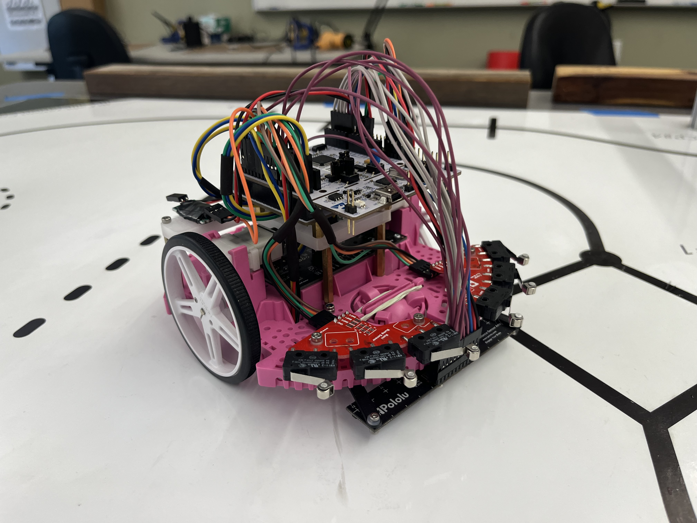

Hardware
================================================================================

Overview
-----------
Using Pololu's ROMI Chassis Kit (PN 3501), we were able to assemble, program, optimize, and run a differential-drive robot to complete a timed course. This was achieved with multiple pieces of hardware. In addition to two DC motors, two encoders provide the angular position and velocity of each motor. A light reflectance array enables line following, while the added IMU provides heading and yaw rate for enhanced navigation. Six bump sensors are included to provide collision feedback. A Bluetooth module is installed for wireless operation of ROMI, and a voltage divider allows us to monitor the battery level supplied to the motor driver. In addition to the motor driver and power distribution board, an STM32-L476RG microcontroller is installed on top of the Shoe of Brian breakout board, running MicroPython.

With this hardware, we are able to quickly and reliably navigate the predefined course.

STM32-L476RG Nucleo
-------------
Romi is powered by an STM32-L476RG Nucleo microcontroller running MicroPython. This setup allows us to program Romi using object-oriented programming and cooperative multitasking with a scheduler, enabling us to run all tasks and drivers efficiently and simultaneously. The microcontroller provides a variety of interfaces, including PWM, analog, digital, timer, and more, allowing us to control all of Romi’s hardware from a single microcontroller.

Shoe of Brian
---------------
The STM32-L476RG Nucleo is inserted into the top of the Shoe of Brian, a breakout board. This provides additional pins (which were not utilized in this project) and allows us to flash code through a USB Mini Type B connection.

Motor Driver and Power Distribution Board for Romi Chassis
-----------------------------------------------------------
To control each motor independently, we use the Pololu Motor Driver and Power Distribution Board for the Romi Chassis (PN 3543). This board features two DRV8838 motor drivers, one for each of the chassis’s motors, allowing for two-channel motor driving. Each motor is controlled via a PWM signal and a direction pin, enabling a range of speed settings (from 0% to 100% effort) and control over the direction of rotation. This setup provides precise control over both motor speed and direction, facilitating independent operation of each motor.

Motor
----------
Romi's movement is powered by two 120:1 Mini Plastic Gearmotors HP with an offset 3mm D-shaft output and an extended motor shaft. These motors feature a 120:1 gear reduction, which enables precise movement and accurate encoder positioning. The motors are driven using Pulse Width Modulation (PWM), allowing control over the effective voltage applied to each motor. By dynamically adjusting this voltage, Romi can precisely regulate the angular velocity of each wheel using a closed-loop control system.

This motor setup ensures accurate speed control, allowing for smooth and predictable motion while maintaining precise position tracking for complex navigation. With the ability to drive bidirectionally, Romi can reverse or adjust its path as needed. By integrating these motors with encoders and a PID controller, Romi achieves stable and responsive movement, which is crucial for line following and waypoint navigation.

Encoder 
--------
The Romi Encoder Pair Kit (Pololu PN 3542) is used in the final assembly to provide precise wheel movement data. These encoders offer a resolution of approximately 1440 counts per revolution of Romi's wheels.
The encoders are dual-channel Hall effect sensor boards, which are soldered directly to the back of each motor and connected to the motor driver and power distribution board of the Romi chassis.

This setup is particularly useful for tracking translational movement, allowing us to determine how far each wheel has traveled and measuring angular velocity of each wheel in real time. By using these encoders, Romi can achieve precise movement control, improving accuracy in navigation.

Bump Sensor
------------
To detect collisions, two Right Bumper Switch Assemblies (Pololu item #: 3674) were installed on the front of ROMI. Each pin of the bump sensor array is initialized as a pull-down input, allowing the system to periodically check for button presses. A total of six bump switches are active, providing feedback on forward collisions.

In addition to detecting when ROMI makes contact with the wall after checkpoint 5, these bump sensors serve as a safety feature. If ROMI veers off course and an unexpected bumper switch is triggered, indicating unintended contact, the program will terminate, preventing potential damage to the robot.

Reflectance Sensor Array
--------------------------
We use the Pololu QTR-MD-13A Reflectance Sensor Array, a 13-channel sensor with an 8mm pitch and analog output, for line detection on our ROMI robot. This sensor array consists of infrared (IR) LED and phototransistor pairs that detect variations in surface reflectance. By periodically reading the reflectance values from each sensor, we can determine the position of a line relative to the sensor array.

A PID controller processes this data, adjusting the robot’s movement to keep the detected line centered within the array. The controller dynamically corrects deviations, ensuring smooth and accurate line following. This setup enables ROMI to navigate a predefined path with precision.

The Reflectance Sensor Array is powered by the 5V pin from the STM32 Nucleo, along with a ground connection and a control pin used to dim the IR emitters. Each of the 13 IR reflectance sensors provides an analog output. However, due to hardware limitations, only 12 of the 13 sensor pins are utilized.

Reflectance Sensor Array Mounts
--------------------------------
Since our ROMI robot utilizes a 13-sensor light array, there was no convenient mounting location on the chassis. To resolve this, a custom 3D-printed bracket was designed to securely attach the sensor. The bracket was modeled in SolidWorks and 3D-printed using PLA filament. It is mounted to the robot using M2 fasteners and stand-offs, ensuring a stable and properly positioned sensor for accurate line detection.

IMU
-------
To provide heading and yaw rate information to Romi, we used Adafruit's BNO055 Absolute Orientation Sensor, an Inertial Measurement Unit (IMU). This 9-DOF sensor communicates via the I2C protocol and features embedded sensor fusion modes, allowing it to output quaternions, Euler angles, or vectors.

In our implementation, we utilized Euler angles to periodically update the system with heading and yaw rate information. This was especially critical when Romi relied solely on heading for navigation.

Bluetooth Module
----------------
For wireless communication, we utilized an HC-05 Bluetooth module. While this module did not allow us to flash new code to Romi via Bluetooth, it was highly effective for serial communication. This capability was particularly useful for motor parameterization, including determining time constants and gains, reflectance sensor calibration, and general course execution. By leveraging Bluetooth connectivity, we could tune and monitor Romi's performance without requiring a wired connection.

Voltage Divider
------------------
The purpose of this is voltage divider is to read the voltage the batteries are suppling to the motor driver. Since the voltage could read as high as 8 volts, a voltage divider is used to reduce the voltage going to a ADC pin to less than 3.3 volts in order to not damage the Nucleo. The following circuit is used to the voltage from the motor driver to the Nucleo the same, while also providing a third pin at a reduced voltage.

*insert circuit

Since the voltage divider follows the relation below, we can both ensure that the ADC pin doesn't exceed 3.3 volts, and calculate the equivalent voltage coming from the motor driver. 

VADC = (R2 / R2 + R1 ) * Vin

In our case we used two resistors in series totaling a resistance of 11.11 kΩs for R1, and one resistor with a resistance of 5.54 kΩs. This would results in a max ADC voltage reading of 2.7 volts when suppled with input voltage of 8.4 volts. 

Inside voltage.py, the actual motor driver voltage is calculated using:

Vss = Vpin * 3.3 * ((R2 + R1)/R2) / 4095

To account for additional resistances in the system, these values may be adjusted additionally. That can be done by measuring the actual voltage coming from the motor driver and comparing to the ADC read value. The following equation worked well for our particular case:

Vss = Vpin * 3.12 * 3.0 / 4095 

*insert open pieces

The circuit can be quickly made using a prototype board and can be inserted in the connection from the motor driver, to Vin to the Nucleo. The voltage divider should be wrapped in insulating tape to prevent unwanted shorts. 

*insert covered
