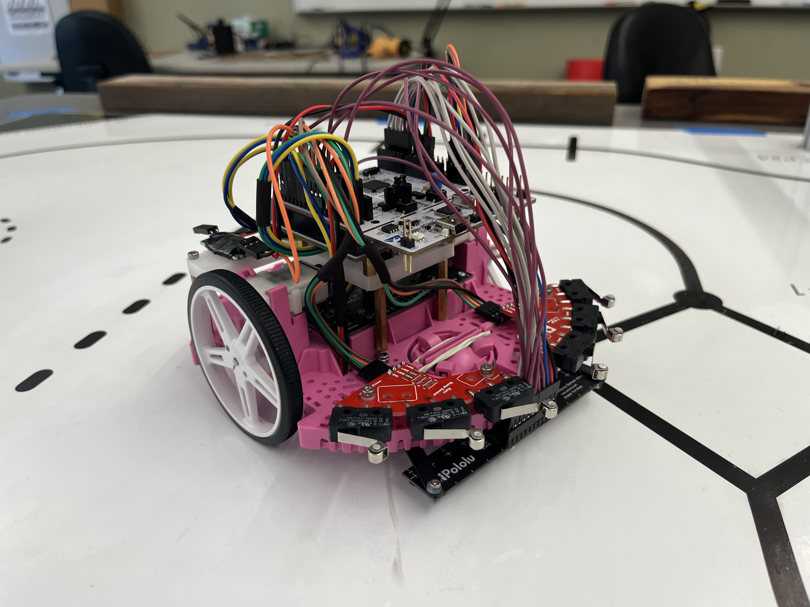
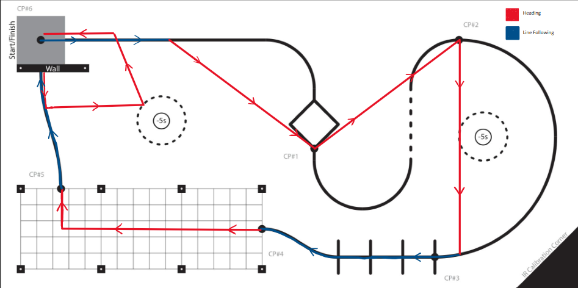

MECHA03 ROMI documentation
==========================

**Authors: Col Cook and Nathan Neugeboren**

**Instructor: Charlie Revfem**

Summary
-------
Over the course of a 10 week quarter, we worked through labs which built-up 
mechatronics skills using a 2-wheeled robot ROMI.

We implemented multitasking programs to characterize motor constants, use an 
Infra-red Line Sensor to follow a line in a circle, and interfaced with an IMU 
over I2C to point in a specific heading. All of this came together through in 
our final project in which ROMI had to make its way through a course, hitting
checkpoints, navigating through a tight space, detecting a wall, and making it 
all the way back to the starting position, with the added bonus of time 
deductions for pushing cups outside of a designated zone.

Course & Strategy
-----------------

Our strategy was to cut as many corners as possible, seperating the track into 
many straight-line segments. For each segement we controlled the heading of ROMI
based either on line following or IMU heading and measured the distance traveled
to determine when to switch to the next line segment. This strategy allowed us 
to achieve the fastest time in the class, consitently achieving times of
approximately 7 seconds and pushing both cups out of their zones resulting in a 
-10 second deduction. Our fastest time, including deductions was -3.10 seconds, 
the video of this time is shown below.

.. video:: _static/mecha03_6_90_seconds.mp4
   :width: 100%

We implemented a cascaded control scheme which allowed for high performance 
control of the motor velocities, yaw rate, and heading. Each motor is controlled
individually to ensure that requested motor velocities are quickly realized.
Next the yaw rate is measured using the IMU and controlled to allow for precise
control of the rate ROMI turns enabling quick and accurate turns. Finally the 
heading or centroid is controlled with feedback from the IMU or line sensor, 
the output of the controller is then the desired yaw rate fed into the yaw rate
controller.

Contents
--------

.. toctree::
   :maxdepth: 3
   
   hardware
   drivers/index
   tasks/index
   